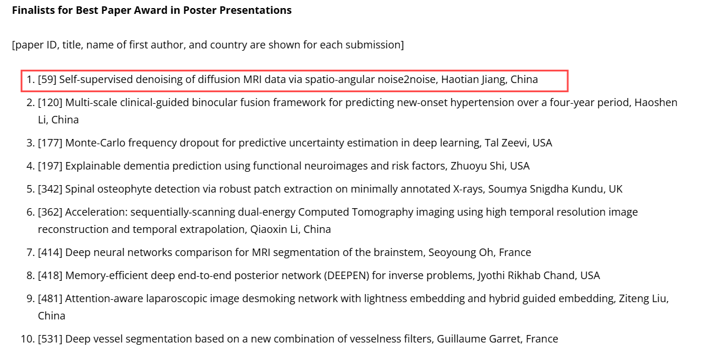
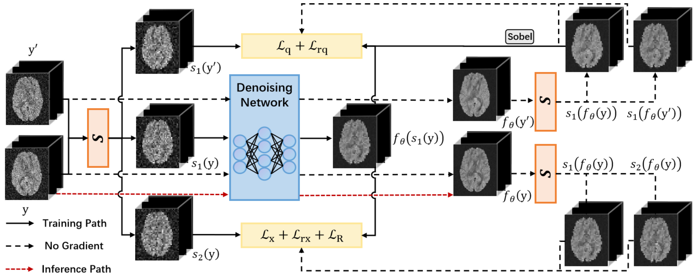
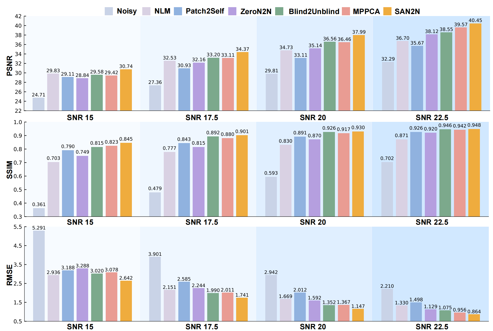

# SAN2N: Spatio-Angular Noise2Noise for Self-Supervised Diffusion MRI Denoising


This repository contains the official implementation of **SAN2N**, a self-supervised deep learning method for denoising Diffusion MRI (DMRI) data. SAN2N leverages spatio-angular redundancy in DMRI to construct paired noisy patches for training, eliminating the need for clean ground-truth data.

📌 **Conference Version**: This work is an extension of our 2024 ISBI conference paper, which received the **[Best Poster Award Nomination](https://biomedicalimaging.org/2024/best-paper-award-finalists-announced-2/)**💥💥💥.
  

---

## 🧠 Overview

### Problem Statement
DMRI is inherently affected by substantial noise, which reduces the precision and reliability of derived diffusion metrics. Traditional deep learning methods require noisy-clean image pairs for supervised training, which are unavailable in clinical practice.

### Our Solution
SAN2N introduces a novel self-supervised framework that:
- Constructs angular neighbors in q-space based on geometric similarity
- Uses spatial sub-samplers to extract 3D patches with spatio-angular redundancy
- Trains a lightweight 3D CNN using a mixture denoising loss function

### Key Features
- ✅ No clean data required for training
- ✅ Exploits both spatial and angular redundancy
- ✅ Edge-aware regularization and Rician likelihood loss
- ✅ Lightweight and efficient 3D CNN architecture

---

## 📊 Method Overview

### Framework
  
*Figure 1: Overall architecture of SAN2N.*
---

## 🚀 Quick Start

### Prerequisites
- Python 3.8+
- PyTorch 1.9+
- Nibabel
- scikit-learn
- DIPY


### 📁 Preprocessing
```shell 
data/
├── subject1/
  ├── dwi.nii.gz   # Raw DMRI data
  ├── bvals        # b-values
  ├── bvecs        # b-vectors
  └── mask.nii.gz  # Brain mask
```

Generate training patches using the preprocessing script:
```bash
python get_data_final.py 
```


### 🧪 Training
```bash
python san2n.py 
  --train_sim1_dirs /path/to/train_patches1.npy # Path to the first set of noisy patches\
  --train_sim2_dirs /path/to/train_patches2.npy # Path to the second set of noisy patches\
  --mask_path /path/to/mask.nii.gz #Path to the estimated noise sigma map\
  --sigma_path /path/to/sigma.npy #Path to the estimated noise sigma map\
```
### 📈 Results
  
*Figure 2: Qualitative denoising results on simulated DMRI data.*

### 🙏 Acknowledgments
This work was supported by the National Natural Science Foundation of China\
The conference version of this work was presented at ISBI 


### 📧 Contact
For questions or suggestions, please contact:

Haotian Jiang: jianghaotian@mail.nwpu.edu.cn\
Geng Chen: geng.chen@ieee.org
